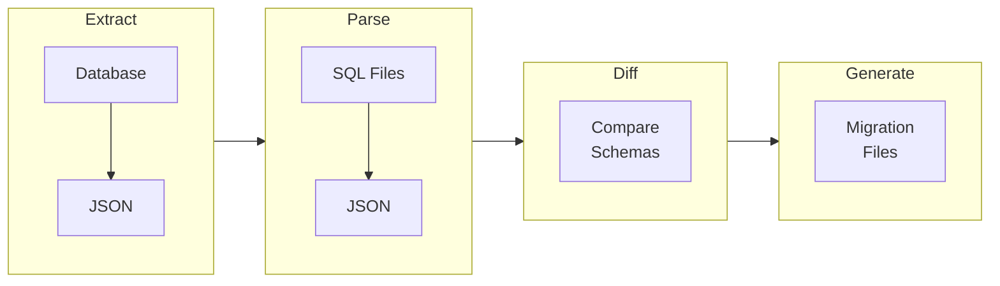
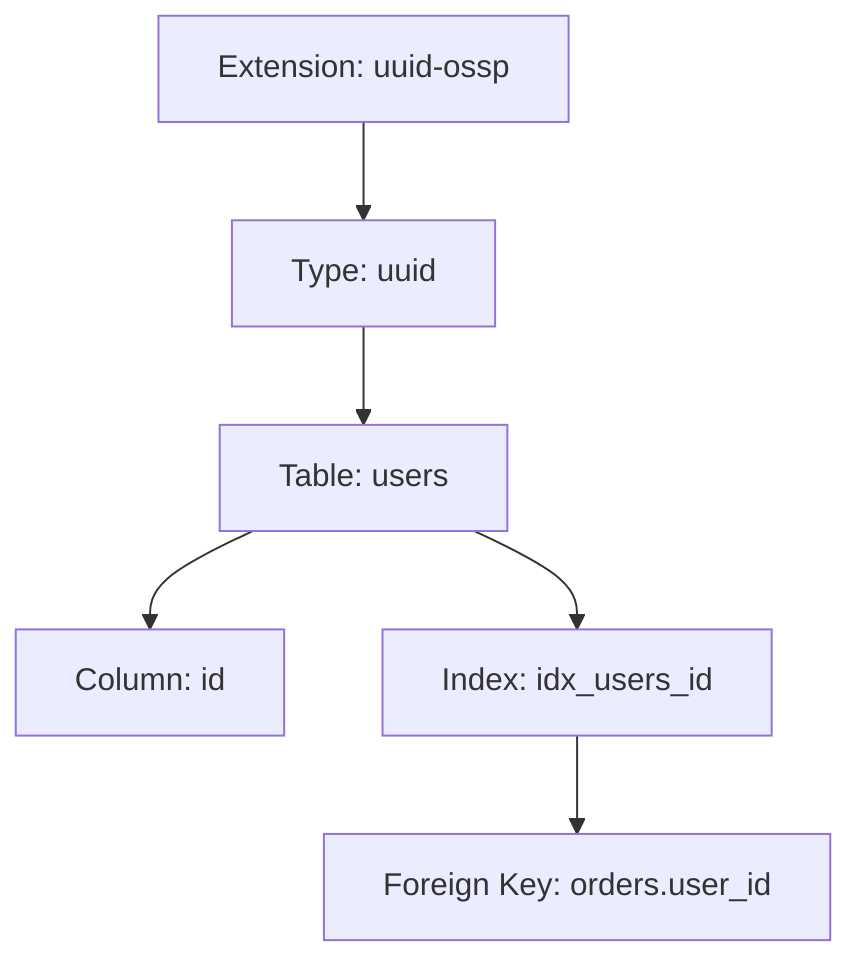

pgtofu transforms database schema management from an imperative process (writing migrations) to a declarative one (defining desired state). This page explains the key concepts that make this possible.

## The Four Phases

pgtofu operates in four distinct phases:



<CardGroup cols={2}>
  <Card title="Extract" icon="database" href="/cli/extract">
    Connect to PostgreSQL and export the current schema as JSON
  </Card>
  <Card title="Parse" icon="code" href="/concepts/how-it-works">
    Parse SQL files defining your desired schema into JSON
  </Card>
  <Card title="Diff" icon="code-compare" href="/cli/diff">
    Compare current and desired schemas to detect changes
  </Card>
  <Card title="Generate" icon="file-code" href="/cli/generate">
    Create ordered migration files from detected changes
  </Card>
</CardGroup>

## Declarative vs Imperative

### Imperative Approach (Traditional)

With traditional migration tools, you manually write each change:

```sql
-- 20240115_add_users.up.sql
CREATE TABLE users (
    id SERIAL PRIMARY KEY,
    email VARCHAR(255)
);

-- 20240116_add_name.up.sql
ALTER TABLE users ADD COLUMN name VARCHAR(100);

-- 20240117_add_created_at.up.sql
ALTER TABLE users ADD COLUMN created_at TIMESTAMPTZ DEFAULT NOW();
```

Problems:
- Hard to see current schema state
- Easy to miss dependencies
- Manual ordering required
- Merge conflicts are common

### Declarative Approach (pgtofu)

With pgtofu, you define the desired end state:

```sql
-- schema/tables/users.sql
CREATE TABLE users (
    id SERIAL PRIMARY KEY,
    email VARCHAR(255),
    name VARCHAR(100),
    created_at TIMESTAMPTZ DEFAULT NOW()
);
```

pgtofu automatically:
- Compares with current database
- Detects what changed
- Orders changes correctly
- Generates safe migrations

## Schema Representation

Both extracted and parsed schemas are normalized to the same JSON format:

```json
{
  "tables": [{
    "schema": "public",
    "name": "users",
    "columns": [{
      "name": "id",
      "data_type": "integer",
      "is_nullable": false,
      "is_identity": true
    }, {
      "name": "email",
      "data_type": "character varying",
      "max_length": 255,
      "is_nullable": true
    }],
    "constraints": [{
      "name": "users_pkey",
      "type": "PRIMARY KEY",
      "columns": ["id"]
    }]
  }]
}
```

This normalized representation enables accurate comparison regardless of:
- SQL formatting differences
- Type alias variations (`VARCHAR` vs `character varying`)
- Whitespace and comments

## Change Detection

The differ compares schemas field-by-field and detects:

| Category | Examples |
|----------|----------|
| **Additions** | New tables, columns, indexes, constraints |
| **Deletions** | Removed objects |
| **Modifications** | Changed types, defaults, definitions |

Each change is classified by severity:
- **SAFE** - Non-breaking additions
- **POTENTIALLY_BREAKING** - May affect applications
- **BREAKING** - May cause data loss
- **DATA_MIGRATION_REQUIRED** - Cannot be automated

## Dependency Resolution

pgtofu uses [topological sorting](/concepts/how-it-works#dependency-resolution) to order changes correctly:



Changes are ordered so dependencies are created before dependents, and dropped in reverse order.

## Migration Generation

The generator creates golang-migrate compatible files with:

- **Idempotent DDL** - `IF EXISTS` / `IF NOT EXISTS` clauses
- **Transaction control** - Wrapped in `BEGIN`/`COMMIT` when safe
- **Reversibility** - Both up and down migrations generated
- **Safety warnings** - Breaking changes are flagged

## Key Principles

<AccordionGroup>
  <Accordion title="Single Source of Truth">
    Your SQL files in version control are the authoritative schema definition. The database state is derived, not authoritative.
  </Accordion>
  <Accordion title="Correctness Over Convenience">
    pgtofu prioritizes generating safe, correct migrations over minimizing migration count or simplifying output.
  </Accordion>
  <Accordion title="Explicit Over Implicit">
    All schema objects must be explicitly defined. pgtofu doesn't infer or assume schema elements.
  </Accordion>
  <Accordion title="Reproducibility">
    Given the same current schema and desired schema, pgtofu always generates the same migrations.
  </Accordion>
</AccordionGroup>

## Next Steps

<CardGroup cols={2}>
  <Card title="How It Works" icon="gears" href="/concepts/how-it-works">
    Technical details of the processing pipeline
  </Card>
  <Card title="PostgreSQL Features" icon="database" href="/features/postgresql">
    Supported PostgreSQL features
  </Card>
  <Card title="TimescaleDB Features" icon="clock" href="/features/timescaledb">
    TimescaleDB support
  </Card>
  <Card title="CLI Reference" icon="terminal" href="/cli/overview">
    Complete command reference
  </Card>
</CardGroup>
