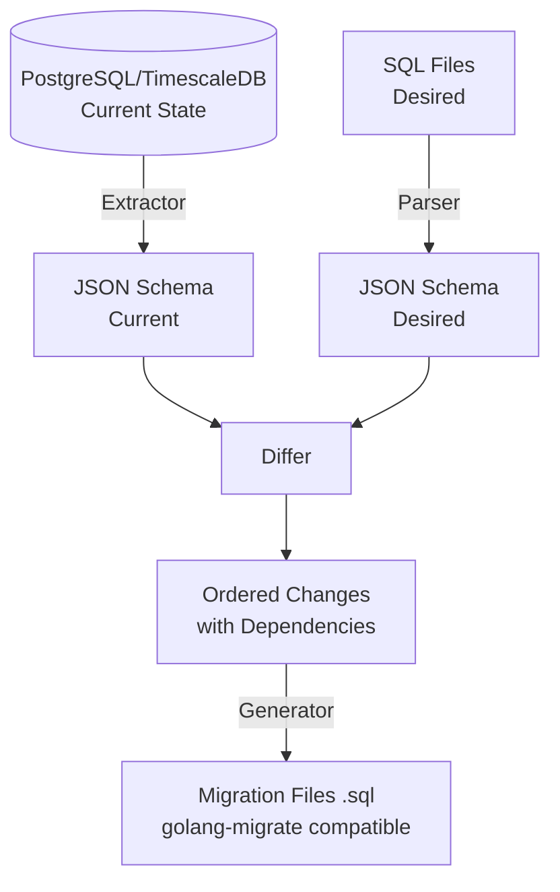

**pgtofu** is a state-based database migration tool that enables declarative schema management for PostgreSQL and TimescaleDB. Define your desired schema in SQL files, and pgtofu automatically generates safe, versioned migration files compatible with [golang-migrate](https://github.com/golang-migrate/migrate).

<CardGroup cols={2}>
  <Card title="Quickstart" icon="rocket" href="/quickstart">
    Get up and running with pgtofu in 5 minutes
  </Card>
  <Card title="Installation" icon="download" href="/installation">
    Install pgtofu via Docker or from source
  </Card>
  <Card title="CLI Reference" icon="terminal" href="/cli/overview">
    Complete reference for all CLI commands
  </Card>
  <Card title="How It Works" icon="sitemap" href="/concepts/how-it-works">
    Deep dive into how pgtofu works
  </Card>
</CardGroup>

## The Problem

Traditional migration tools require manually writing incremental migration files. This approach has several drawbacks:

<AccordionGroup>
  <Accordion title="Hard to understand current state">
    With dozens or hundreds of migration files, understanding what your current schema looks like requires mentally replaying all migrations or examining the live database.
  </Accordion>
  <Accordion title="Easy to introduce inconsistencies">
    Manual migration writing is error-prone. Forgetting to update a foreign key, missing an index, or using inconsistent naming conventions is common.
  </Accordion>
  <Accordion title="Requires tracking dependencies manually">
    When adding a foreign key to a table that doesn't exist yet, you need to manually ensure the referenced table is created first.
  </Accordion>
  <Accordion title="Difficult to resolve conflicts">
    When multiple developers modify the schema simultaneously, resolving merge conflicts in migration files is tedious and risky.
  </Accordion>
</AccordionGroup>

## The Solution

pgtofu uses a **declarative approach**:

<Steps>
  <Step title="Extract">
    Extract the current database schema into a JSON representation
  </Step>
  <Step title="Define">
    Define your desired schema in organized SQL files
  </Step>
  <Step title="Compare">
    Compare current vs. desired schema to detect differences
  </Step>
  <Step title="Generate">
    Generate safe, ordered migration files automatically
  </Step>
  <Step title="Apply">
    Apply migrations using golang-migrate or any compatible tool
  </Step>
</Steps>

## Key Features

<CardGroup cols={2}>
  <Card title="Full PostgreSQL Support" icon="database">
    Tables, indexes, views, functions, triggers, constraints, sequences, custom types, and more
  </Card>
  <Card title="TimescaleDB Native" icon="clock">
    First-class support for hypertables, compression policies, retention policies, and continuous aggregates
  </Card>
  <Card title="Smart Diff Engine" icon="code-compare">
    40+ change types with severity classification (SAFE, POTENTIALLY_BREAKING, BREAKING, DATA_MIGRATION_REQUIRED)
  </Card>
  <Card title="Dependency Resolution" icon="diagram-project">
    Topological sorting ensures correct execution order for all schema changes
  </Card>
  <Card title="Safe Migrations" icon="shield-check">
    Breaking change detection, idempotent DDL, and transaction control
  </Card>
  <Card title="golang-migrate Compatible" icon="plug">
    Drop-in replacement for existing migration workflows
  </Card>
</CardGroup>

## Design Principles

1. **Correctness First** - Never lose data; always generate safe migrations
2. **TimescaleDB Native** - First-class support for all TimescaleDB features
3. **Declarative** - Define desired state; the tool figures out how to get there
4. **golang-migrate Compatible** - Works seamlessly with existing migration workflows
5. **Production Ready** - Comprehensive testing, error handling, and validation

## How It Works

## Next Steps

<CardGroup cols={2}>
  <Card title="Quickstart Guide" icon="play" href="/quickstart">
    Follow a step-by-step tutorial to understand the basic workflow
  </Card>
  <Card title="Core Concepts" icon="book" href="/concepts/overview">
    Learn about declarative migrations and how pgtofu processes schemas
  </Card>
</CardGroup>
